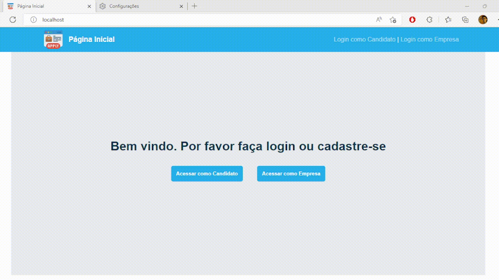

para ver o projeto funcionando: https://sistema-de-candidaturas.leudoneto.repl.co

# Documentação do projeto

## 🚀 Instalação

>  git clone https://github.com/LeudoNeto/teste-django.git

## 💻 Execução

> 
> - ` 1. ` cd teste-django
>
> - ` 2. ` python3 manage.py runserver 80
>
> - ` 3. ` No seu `navegador` acesse `http://localhost`.

# Testes funcionando:

## Acessando como Empresa:

## Acessando como Candidato:

